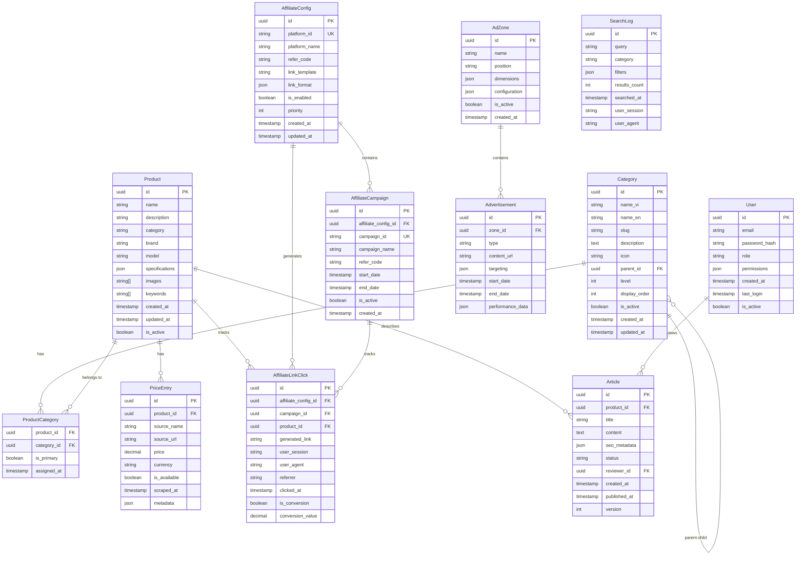

# Design Document: Product Price Comparison Website

## Overview

The Product Price Comparison Website is a public-facing web application designed for the Vietnamese market, similar to websosanh.vn and sosanhgiatot.com.vn. The system enables users to search and compare product prices from multiple e-commerce platforms without requiring authentication, while providing administrative tools for content management and system configuration.

### Key Design Principles

1. **Public-First Architecture**: All core functionality accessible without authentication
2. **Mobile-First Responsive Design**: Optimized for mobile and tablet experiences
3. **High Performance**: Sub-2-second page loads with aggressive caching
4. **Scalable Data Collection**: Multi-source price aggregation with fault tolerance
5. **Flexible Advertisement System**: Customizable ad placements with performance tracking
6. **AI-Enhanced Content**: Automated article generation with human oversight
7. **SEO Optimization**: Structured data and search engine visibility

### System Boundaries

**In Scope:**
- Public product search and price comparison
- Multi-source data collection (APIs and web scraping)
- Administrative dashboards for system and content management
- AI-powered content generation with reviewer approval
- Flexible advertisement management system
- Affiliate link management with refer-code tracking
- Mobile-optimized responsive design
- SEO optimization and analytics

**Out of Scope:**
- User account management for public users
- E-commerce transaction processing
- Inventory management
- Customer support ticketing system
- Multi-language support (Vietnamese only)
- Affiliate commission calculation and payment processing

## Architecture

### High-Level Architecture

The system follows a microservices architecture with clear separation of concerns:

```mermaid
graph TB
    subgraph "Client Layer"
        PWA[Progressive Web App]
        AdminUI[Admin Dashboard]
        ReviewerUI[Reviewer Dashboard]
    end
    
    subgraph "API Gateway"
        Gateway[API Gateway/Load Balancer]
    end
    
    subgraph "Application Services"
        SearchAPI[Search Service]
        PriceAPI[Price Comparison Service]
        ContentAPI[Content Management Service]
        AdminAPI[Admin Service]
        AnalyticsAPI[Analytics Service]
        AdAPI[Advertisement Service]
    end
    
    subgraph "Data Collection Layer"
        DataCollector[Data Collection Service]
        APIIntegrator[API Integrator]
        WebScraper[Web Scraper]
        AIGenerator[AI Content Generator]
    end
    
    subgraph "Data Layer"
        ProductDB[(Product Database)]
        PriceDB[(Price History Database)]
        ContentDB[(Content Database)]
        AnalyticsDB[(Analytics Database)]
        Cache[(Redis Cache)]
    end
    
    subgraph "External Services"
        TikiAPI[Tiki API]
        LazadaAPI[Lazada API]
        TikTokAPI[TikTok Shop API]
        RetailSites[Retail Websites]
        GoogleAds[Google Ads]
        AIService[AI Service Provider]
    end
    
    PWA --> Gateway
    AdminUI --> Gateway
    ReviewerUI --> Gateway
    
    Gateway --> SearchAPI
    Gateway --> PriceAPI
    Gateway --> ContentAPI
    Gateway --> AdminAPI
    Gateway --> AnalyticsAPI
    Gateway --> AdAPI
    
    SearchAPI --> ProductDB
    SearchAPI --> Cache
    PriceAPI --> PriceDB
    PriceAPI --> Cache
    ContentAPI --> ContentDB
    AdminAPI --> ProductDB
    AdminAPI --> ContentDB
    AnalyticsAPI --> AnalyticsDB
    AdAPI --> ContentDB
    
    DataCollector --> APIIntegrator
    DataCollector --> WebScraper
    DataCollector --> ProductDB
    DataCollector --> PriceDB
    
    APIIntegrator --> TikiAPI
    APIIntegrator --> LazadaAPI
    APIIntegrator --> TikTokAPI
    
    WebScraper --> RetailSites
    
    AIGenerator --> AIService
    AIGenerator --> ContentDB
    
    AdAPI --> GoogleAds
```



### Technology Stack

**Frontend:**
- **Framework**: Next.js 14 with App Router for SSR/SSG capabilities
- **UI Library**: Tailwind CSS with Headless UI components
- **State Management**: Zustand for client-side state
- **PWA**: Next-PWA for progressive web app features
- **Analytics**: Google Analytics 4 with custom event tracking

**Backend:**
- **Runtime**: Node.js 20 LTS
- **Framework**: Express.js with TypeScript
- **API Documentation**: OpenAPI 3.0 with Swagger UI
- **Authentication**: JWT with refresh tokens for admin users
- **Validation**: Zod for request/response validation

**Data Collection:**
- **Web Scraping**: Puppeteer with Playwright for dynamic content
- **API Integration**: Axios with retry logic and rate limiting
- **Queue System**: Bull Queue with Redis for background jobs (integrated in backend service)
- **Proxy Management**: Rotating proxy service for scraping

**Databases:**
- **Primary Database**: PostgreSQL 15 with read replicas
- **Full-Text Search**: PostgreSQL Full-Text Search with GIN indexes and trigram extension
- **Cache**: Redis 7 for session storage and query caching (512 MB allocation)
- **Analytics**: PostgreSQL with partitioned tables for analytics data (no separate ClickHouse needed for < 50K products)

**Infrastructure:**
- **Containerization**: Docker with multi-stage builds
- **Orchestration**: Kubernetes for production deployment (optional for later phase)
- **CDN**: CloudFlare for static asset delivery
- **Monitoring**: Prometheus + Grafana for metrics
- **Logging**: Self-hosted logging with PostgreSQL or simple file-based logging

**AI Integration:**
- **Content Generation**: OpenAI GPT-4 or Claude API
- **Image Processing**: Sharp for image optimization
- **SEO Tools**: Custom meta tag generation and sitemap builder

## Components and Interfaces

### Core Components

#### 1. Search Service
**Responsibilities:**
- Process search queries with fuzzy matching
- Implement search filters and sorting
- Provide search suggestions and autocomplete
- Track popular search terms

**Key Interfaces:**
```typescript
interface SearchService {
  searchProducts(query: SearchQuery): Promise<SearchResult[]>
  getSuggestions(partial: string): Promise<string[]>
  getPopularKeywords(): Promise<PopularKeyword[]>
  trackSearch(query: string, userId?: string): Promise<void>
}

interface SearchQuery {
  keyword: string
  category?: string
  priceRange?: PriceRange
  brand?: string
  sortBy?: SortOption
  page: number
  limit: number
}
```

#### 2. Price Comparison Service
**Responsibilities:**
- Aggregate prices from multiple sources
- Calculate price trends and history
- Identify best deals and lowest prices
- Handle price update scheduling

**Key Interfaces:**
```typescript
interface PriceComparisonService {
  getProductPrices(productId: string): Promise<PriceComparison>
  getPriceHistory(productId: string, days: number): Promise<PriceHistory[]>
  getBestDeals(category?: string): Promise<Deal[]>
  updatePrices(productIds: string[]): Promise<UpdateResult>
}

interface PriceComparison {
  productId: string
  prices: PriceEntry[]
  lowestPrice: PriceEntry
  averagePrice: number
  lastUpdated: Date
}
```

#### 3. Data Collection Service
**Responsibilities:**
- Coordinate data collection from multiple sources
- Handle API rate limiting and error recovery
- Manage web scraping with proxy rotation
- Validate and normalize collected data

**Key Interfaces:**
```typescript
interface DataCollectionService {
  collectFromAPIs(keywords: string[]): Promise<CollectionResult>
  scrapeWebsites(urls: string[]): Promise<ScrapingResult>
  validateProductData(data: RawProductData): Promise<ProductData>
  scheduleCollection(frequency: string): Promise<void>
}
```

#### 4. Content Management Service
**Responsibilities:**
- Generate AI-powered product articles
- Manage content approval workflow
- Handle SEO optimization
- Version control for content changes

**Key Interfaces:**
```typescript
interface ContentManagementService {
  generateArticle(keyword: string): Promise<GeneratedArticle>
  submitForReview(articleId: string): Promise<void>
  approveArticle(articleId: string, reviewerId: string): Promise<void>
  publishArticle(articleId: string): Promise<void>
  optimizeForSEO(content: string): Promise<SEOOptimizedContent>
}
```

#### 5. Advertisement Service
**Responsibilities:**
- Manage advertisement placements and zones
- Handle Google Ads integration
- Track advertisement performance
- Support A/B testing for ad placements

**Key Interfaces:**
```typescript
interface AdvertisementService {
  createAdZone(zone: AdZoneConfig): Promise<AdZone>
  updateAdPlacement(zoneId: string, config: PlacementConfig): Promise<void>
  trackAdPerformance(adId: string, event: AdEvent): Promise<void>
  getPerformanceMetrics(zoneId: string): Promise<AdMetrics>
}
```

#### 6. Category Management Service
**Responsibilities:**
- Manage hierarchical product categories
- Handle category-product associations
- Generate category navigation structures
- Track category-based analytics

**Key Interfaces:**
```typescript
interface CategoryManagementService {
  createCategory(category: CategoryInput): Promise<Category>
  updateCategory(categoryId: string, updates: CategoryUpdate): Promise<Category>
  deleteCategory(categoryId: string): Promise<void>
  getCategoryTree(): Promise<CategoryTree>
  assignProductToCategories(productId: string, categoryIds: string[]): Promise<void>
  getProductsByCategory(categoryId: string, includeSubcategories: boolean): Promise<Product[]>
  getCategoryMetrics(categoryId: string): Promise<CategoryMetrics>
}

interface Category {
  id: string
  nameVi: string
  nameEn: string
  slug: string
  description: string
  icon?: string
  parentId?: string
  level: number
  productCount: number
  isActive: boolean
  metadata: CategoryMetadata
}

interface CategoryTree {
  category: Category
  children: CategoryTree[]
}
```

#### 7. Affiliate Link Management Service
**Responsibilities:**
- Manage affiliate configurations for e-commerce platforms
- Generate affiliate links with refer-codes
- Track affiliate link clicks and conversions
- Support multiple link formats and campaign tracking
- Provide performance analytics for affiliate programs

**Key Interfaces:**
```typescript
interface AffiliateLinkService {
  createAffiliateConfig(config: AffiliateConfigInput): Promise<AffiliateConfig>
  updateAffiliateConfig(platformId: string, updates: AffiliateConfigUpdate): Promise<AffiliateConfig>
  deleteAffiliateConfig(platformId: string): Promise<void>
  getAffiliateConfigs(): Promise<AffiliateConfig[]>
  generateAffiliateLink(productUrl: string, platformId: string, campaignId?: string): Promise<string>
  trackAffiliateLinkClick(linkId: string, metadata: ClickMetadata): Promise<void>
  getAffiliatePerformance(platformId: string, dateRange: DateRange): Promise<AffiliatePerformance>
  validateAffiliateLinkFormat(config: AffiliateConfig): Promise<ValidationResult>
}

interface AffiliateConfig {
  id: string
  platformId: string
  platformName: string
  referCode: string
  linkTemplate: string
  linkFormat: AffiliateLinkFormat
  isEnabled: boolean
  priority: number
  campaignConfigs: CampaignConfig[]
  createdAt: Date
  updatedAt: Date
}

interface AffiliateLinkFormat {
  type: 'query_param' | 'path_param' | 'subdomain' | 'custom'
  parameterName?: string // e.g., 'ref', 'aff_id'
  template: string // e.g., '{base_url}?ref={refer_code}&product={product_id}'
  exampleUrl: string
}

interface CampaignConfig {
  campaignId: string
  campaignName: string
  referCode: string
  startDate: Date
  endDate?: Date
  isActive: boolean
}

interface AffiliatePerformance {
  platformId: string
  totalClicks: number
  totalConversions: number
  conversionRate: number
  estimatedRevenue: number
  clicksByDate: ClickData[]
  topProducts: ProductPerformance[]
}

interface ClickMetadata {
  userSession: string
  userAgent: string
  referrer?: string
  productId: string
  campaignId?: string
  timestamp: Date
}
```

### External Integrations

#### E-commerce Platform APIs
- **Tiki API**: Product catalog and pricing data
- **Lazada API**: Product information and availability
- **TikTok Shop API**: Product listings and prices

#### Web Scraping Targets
- Major Vietnamese retail websites
- Specialized product category sites
- Regional e-commerce platforms

#### AI Content Generation
- OpenAI GPT-4 for article generation
- Custom prompts for Vietnamese market context
- Content quality validation and fact-checking

## Data Models

### Product Data Model



### Database Schema Design

#### Products Table
```sql
CREATE TABLE products (
    id UUID PRIMARY KEY DEFAULT gen_random_uuid(),
    name VARCHAR(500) NOT NULL,
    description TEXT,
    category VARCHAR(100) NOT NULL,
    brand VARCHAR(100),
    model VARCHAR(200),
    specifications JSONB,
    images TEXT[],
    keywords TEXT[],
    created_at TIMESTAMP DEFAULT NOW(),
    updated_at TIMESTAMP DEFAULT NOW(),
    is_active BOOLEAN DEFAULT true
);

CREATE INDEX idx_products_category ON products(category);
CREATE INDEX idx_products_brand ON products(brand);
CREATE INDEX idx_products_keywords ON products USING GIN(keywords);
CREATE INDEX idx_products_name_search ON products USING GIN(to_tsvector('vietnamese', name));
```

#### Categories Table
```sql
CREATE TABLE categories (
    id UUID PRIMARY KEY DEFAULT gen_random_uuid(),
    name_vi VARCHAR(200) NOT NULL,
    name_en VARCHAR(200) NOT NULL,
    slug VARCHAR(200) NOT NULL UNIQUE,
    description TEXT,
    icon VARCHAR(500),
    parent_id UUID REFERENCES categories(id) ON DELETE CASCADE,
    level INT NOT NULL DEFAULT 0,
    display_order INT DEFAULT 0,
    is_active BOOLEAN DEFAULT true,
    created_at TIMESTAMP DEFAULT NOW(),
    updated_at TIMESTAMP DEFAULT NOW()
);

CREATE INDEX idx_categories_parent_id ON categories(parent_id);
CREATE INDEX idx_categories_slug ON categories(slug);
CREATE INDEX idx_categories_level ON categories(level);
CREATE INDEX idx_categories_active ON categories(is_active);

-- Insert default main categories
INSERT INTO categories (name_vi, name_en, slug, level, display_order) VALUES
    ('Điện lạnh', 'Refrigeration & Air Conditioning', 'dien-lanh', 0, 1),
    ('Thiết bị gia dụng', 'Home Appliances', 'thiet-bi-gia-dung', 0, 2),
    ('Điện thoại', 'Mobile Phones', 'dien-thoai', 0, 3),
    ('Máy tính bảng', 'Tablets', 'may-tinh-bang', 0, 4),
    ('Laptop', 'Laptop', 'laptop', 0, 5),
    ('Cơ khí', 'Mechanical Equipment', 'co-khi', 0, 6),
    ('Thiết bị văn phòng', 'Office Equipment', 'thiet-bi-van-phong', 0, 7),
    ('Âm thanh & Hình ảnh', 'Audio & Video', 'am-thanh-hinh-anh', 0, 8),
    ('Phụ kiện điện tử', 'Electronic Accessories', 'phu-kien-dien-tu', 0, 9),
    ('Đồ gia dụng nhà bếp', 'Kitchen Appliances', 'do-gia-dung-nha-bep', 0, 10);
```

#### Product Categories Junction Table
```sql
CREATE TABLE product_categories (
    product_id UUID REFERENCES products(id) ON DELETE CASCADE,
    category_id UUID REFERENCES categories(id) ON DELETE CASCADE,
    is_primary BOOLEAN DEFAULT false,
    assigned_at TIMESTAMP DEFAULT NOW(),
    PRIMARY KEY (product_id, category_id)
);

CREATE INDEX idx_product_categories_product ON product_categories(product_id);
CREATE INDEX idx_product_categories_category ON product_categories(category_id);
CREATE INDEX idx_product_categories_primary ON product_categories(is_primary);
```

#### Affiliate Configurations Table
```sql
CREATE TABLE affiliate_configs (
    id UUID PRIMARY KEY DEFAULT gen_random_uuid(),
    platform_id VARCHAR(100) NOT NULL UNIQUE,
    platform_name VARCHAR(200) NOT NULL,
    refer_code VARCHAR(500) NOT NULL,
    link_template TEXT NOT NULL,
    link_format JSONB NOT NULL,
    is_enabled BOOLEAN DEFAULT true,
    priority INT DEFAULT 0,
    created_at TIMESTAMP DEFAULT NOW(),
    updated_at TIMESTAMP DEFAULT NOW()
);

CREATE INDEX idx_affiliate_configs_platform ON affiliate_configs(platform_id);
CREATE INDEX idx_affiliate_configs_enabled ON affiliate_configs(is_enabled);
CREATE INDEX idx_affiliate_configs_priority ON affiliate_configs(priority DESC);

-- Insert default affiliate configurations for major platforms
INSERT INTO affiliate_configs (platform_id, platform_name, refer_code, link_template, link_format, priority) VALUES
    ('tiki', 'Tiki', 'YOUR_TIKI_REFER_CODE', '{base_url}?spid={product_id}&aff_sid={refer_code}', 
     '{"type": "query_param", "parameterName": "aff_sid", "template": "{base_url}?spid={product_id}&aff_sid={refer_code}", "exampleUrl": "https://tiki.vn/product.html?spid=123456&aff_sid=YOUR_CODE"}', 1),
    ('lazada', 'Lazada', 'YOUR_LAZADA_REFER_CODE', '{base_url}?aff_short_key={refer_code}', 
     '{"type": "query_param", "parameterName": "aff_short_key", "template": "{base_url}?aff_short_key={refer_code}", "exampleUrl": "https://www.lazada.vn/products/product-name-i123456.html?aff_short_key=YOUR_CODE"}', 2),
    ('tiktok_shop', 'TikTok Shop', 'YOUR_TIKTOK_REFER_CODE', '{base_url}?affiliate_id={refer_code}', 
     '{"type": "query_param", "parameterName": "affiliate_id", "template": "{base_url}?affiliate_id={refer_code}", "exampleUrl": "https://shop.tiktok.com/view/product/123456?affiliate_id=YOUR_CODE"}', 3),
    ('shopee', 'Shopee', 'YOUR_SHOPEE_REFER_CODE', '{base_url}?af_siteid={refer_code}', 
     '{"type": "query_param", "parameterName": "af_siteid", "template": "{base_url}?af_siteid={refer_code}", "exampleUrl": "https://shopee.vn/product-name-i.123456.789012?af_siteid=YOUR_CODE"}', 4),
    ('sendo', 'Sendo', 'YOUR_SENDO_REFER_CODE', '{base_url}?ref={refer_code}', 
     '{"type": "query_param", "parameterName": "ref", "template": "{base_url}?ref={refer_code}", "exampleUrl": "https://www.sendo.vn/product-name-123456.html?ref=YOUR_CODE"}', 5);
```

#### Affiliate Campaigns Table
```sql
CREATE TABLE affiliate_campaigns (
    id UUID PRIMARY KEY DEFAULT gen_random_uuid(),
    affiliate_config_id UUID REFERENCES affiliate_configs(id) ON DELETE CASCADE,
    campaign_id VARCHAR(100) NOT NULL,
    campaign_name VARCHAR(200) NOT NULL,
    refer_code VARCHAR(500) NOT NULL,
    start_date TIMESTAMP NOT NULL,
    end_date TIMESTAMP,
    is_active BOOLEAN DEFAULT true,
    created_at TIMESTAMP DEFAULT NOW(),
    UNIQUE(affiliate_config_id, campaign_id)
);

CREATE INDEX idx_affiliate_campaigns_config ON affiliate_campaigns(affiliate_config_id);
CREATE INDEX idx_affiliate_campaigns_campaign_id ON affiliate_campaigns(campaign_id);
CREATE INDEX idx_affiliate_campaigns_active ON affiliate_campaigns(is_active);
CREATE INDEX idx_affiliate_campaigns_dates ON affiliate_campaigns(start_date, end_date);
```

#### Affiliate Link Clicks Table
```sql
CREATE TABLE affiliate_link_clicks (
    id UUID PRIMARY KEY DEFAULT gen_random_uuid(),
    affiliate_config_id UUID REFERENCES affiliate_configs(id) ON DELETE CASCADE,
    campaign_id UUID REFERENCES affiliate_campaigns(id) ON DELETE SET NULL,
    product_id UUID REFERENCES products(id) ON DELETE SET NULL,
    generated_link TEXT NOT NULL,
    user_session VARCHAR(200),
    user_agent TEXT,
    referrer TEXT,
    clicked_at TIMESTAMP DEFAULT NOW(),
    is_conversion BOOLEAN DEFAULT false,
    conversion_value DECIMAL(12,2),
    conversion_at TIMESTAMP
);

CREATE INDEX idx_affiliate_clicks_config ON affiliate_link_clicks(affiliate_config_id);
CREATE INDEX idx_affiliate_clicks_campaign ON affiliate_link_clicks(campaign_id);
CREATE INDEX idx_affiliate_clicks_product ON affiliate_link_clicks(product_id);
CREATE INDEX idx_affiliate_clicks_clicked_at ON affiliate_link_clicks(clicked_at DESC);
CREATE INDEX idx_affiliate_clicks_conversion ON affiliate_link_clicks(is_conversion);
CREATE INDEX idx_affiliate_clicks_session ON affiliate_link_clicks(user_session);

-- Create a partitioned table for better performance with large click data
-- Partition by month for efficient querying and archiving
CREATE TABLE affiliate_link_clicks_partitioned (
    LIKE affiliate_link_clicks INCLUDING ALL
) PARTITION BY RANGE (clicked_at);

-- Create partitions for the current and next 12 months
-- This should be automated with a maintenance job
```

#### Price Entries Table
```sql
CREATE TABLE price_entries (
    id UUID PRIMARY KEY DEFAULT gen_random_uuid(),
    product_id UUID REFERENCES products(id) ON DELETE CASCADE,
    source_name VARCHAR(100) NOT NULL,
    source_url TEXT NOT NULL,
    price DECIMAL(12,2) NOT NULL,
    currency VARCHAR(3) DEFAULT 'VND',
    is_available BOOLEAN DEFAULT true,
    scraped_at TIMESTAMP DEFAULT NOW(),
    metadata JSONB
);

CREATE INDEX idx_price_entries_product_id ON price_entries(product_id);
CREATE INDEX idx_price_entries_source ON price_entries(source_name);
CREATE INDEX idx_price_entries_scraped_at ON price_entries(scraped_at DESC);
```

### Caching Strategy

#### Redis Cache Structure
```typescript
// Product search results cache
const SEARCH_CACHE_KEY = `search:${hashQuery(query)}`;
const SEARCH_CACHE_TTL = 300; // 5 minutes

// Price comparison cache
const PRICE_CACHE_KEY = `prices:${productId}`;
const PRICE_CACHE_TTL = 3600; // 1 hour

// Popular keywords cache
const POPULAR_KEYWORDS_KEY = 'popular:keywords';
const POPULAR_KEYWORDS_TTL = 1800; // 30 minutes

// Advertisement cache
const AD_ZONE_CACHE_KEY = `ads:zone:${zoneId}`;
const AD_ZONE_CACHE_TTL = 600; // 10 minutes

// Category tree cache
const CATEGORY_TREE_KEY = 'categories:tree';
const CATEGORY_TREE_TTL = 3600; // 1 hour

// Category products cache
const CATEGORY_PRODUCTS_KEY = `category:${categoryId}:products`;
const CATEGORY_PRODUCTS_TTL = 600; // 10 minutes

// Category metrics cache
const CATEGORY_METRICS_KEY = `category:${categoryId}:metrics`;
const CATEGORY_METRICS_TTL = 1800; // 30 minutes

// Affiliate configurations cache
const AFFILIATE_CONFIGS_KEY = 'affiliate:configs:all';
const AFFILIATE_CONFIGS_TTL = 3600; // 1 hour

// Affiliate config by platform cache
const AFFILIATE_CONFIG_PLATFORM_KEY = `affiliate:config:${platformId}`;
const AFFILIATE_CONFIG_PLATFORM_TTL = 3600; // 1 hour

// Active campaigns cache
const AFFILIATE_CAMPAIGNS_KEY = `affiliate:campaigns:${platformId}`;
const AFFILIATE_CAMPAIGNS_TTL = 1800; // 30 minutes

// Affiliate performance cache
const AFFILIATE_PERFORMANCE_KEY = `affiliate:performance:${platformId}:${dateRange}`;
const AFFILIATE_PERFORMANCE_TTL = 600; // 10 minutes
```

## Error Handling

### Error Classification and Response Strategy

#### 1. Data Collection Errors
**API Rate Limiting:**
- Implement exponential backoff with jitter
- Use multiple API keys rotation
- Fallback to web scraping when APIs fail

**Web Scraping Failures:**
- Retry with different proxy servers
- Implement CAPTCHA solving service integration
- Graceful degradation with cached data

**Data Validation Errors:**
- Log invalid data for manual review
- Use fuzzy matching for product normalization
- Maintain data quality metrics

#### 2. Search and Display Errors
**Search Service Failures:**
- Return cached popular results
- Provide alternative search suggestions
- Maintain service availability with degraded functionality

**Price Display Errors:**
- Show "Price not available" message
- Display last known price with timestamp
- Provide direct links to source websites

#### 3. Content Generation Errors
**AI Service Failures:**
- Queue articles for retry
- Fallback to template-based content
- Notify reviewers of generation failures

**Content Approval Workflow:**
- Maintain pending article queue
- Send notifications for review timeouts
- Provide rollback capabilities for published content

### Error Monitoring and Alerting

```typescript
interface ErrorHandlingConfig {
  retryAttempts: number;
  backoffMultiplier: number;
  circuitBreakerThreshold: number;
  alertingThresholds: {
    errorRate: number;
    responseTime: number;
    availability: number;
  };
}

const errorHandling: ErrorHandlingConfig = {
  retryAttempts: 3,
  backoffMultiplier: 2,
  circuitBreakerThreshold: 5,
  alertingThresholds: {
    errorRate: 0.05, // 5%
    responseTime: 2000, // 2 seconds
    availability: 0.99 // 99%
  }
};
```

## Testing Strategy

### Testing Approach Overview

The testing strategy employs a comprehensive approach combining unit tests, integration tests, and end-to-end tests to ensure system reliability and correctness.

#### Unit Testing
- **Framework**: Jest with TypeScript support
- **Coverage Target**: 80% code coverage minimum
- **Focus Areas**:
  - Business logic validation
  - Data transformation functions
  - API request/response handling
  - Error handling scenarios

#### Integration Testing
- **Database Integration**: Test with PostgreSQL test containers
- **API Integration**: Mock external services with realistic responses
- **Cache Integration**: Redis integration tests with test containers
- **Search Integration**: PostgreSQL Full-Text Search with test data

#### End-to-End Testing
- **Framework**: Playwright for cross-browser testing
- **Mobile Testing**: Device emulation for responsive design
- **Performance Testing**: Lighthouse CI for performance metrics
- **SEO Testing**: Automated SEO validation and structured data verification

#### Load Testing
- **Tool**: Artillery.js for load testing scenarios
- **Scenarios**:
  - Concurrent search requests (1000+ users)
  - Price comparison page loads
  - Data collection service stress testing
  - Advertisement serving under load

#### Security Testing
- **OWASP Compliance**: Automated security scanning
- **Input Validation**: SQL injection and XSS prevention
- **Rate Limiting**: API abuse prevention testing
- **Authentication**: JWT token security validation

### Test Data Management

```typescript
interface TestDataConfig {
  products: {
    sampleCount: number;
    categories: string[];
    priceRanges: PriceRange[];
  };
  users: {
    adminUsers: number;
    reviewerUsers: number;
  };
  articles: {
    publishedCount: number;
    pendingCount: number;
  };
}

const testData: TestDataConfig = {
  products: {
    sampleCount: 1000,
    categories: ['Electronics', 'Fashion', 'Home & Garden', 'Sports'],
    priceRanges: [
      { min: 100000, max: 500000 },
      { min: 500000, max: 2000000 },
      { min: 2000000, max: 10000000 }
    ]
  },
  users: {
    adminUsers: 2,
    reviewerUsers: 5
  },
  articles: {
    publishedCount: 100,
    pendingCount: 20
  }
};
```

## Correctness Properties

*A property is a characteristic or behavior that should hold true across all valid executions of a system-essentially, a formal statement about what the system should do. Properties serve as the bridge between human-readable specifications and machine-verifiable correctness guarantees.*

### Property 1: Authentication and Authorization Validation

*For any* user credentials and role assignment, the authentication system SHALL validate credentials correctly and assign appropriate permissions based on user role (Administrator or Reviewer), maintaining session validity for the specified duration.

**Validates: Requirements 1.1, 1.2, 1.5, 1.6**

### Property 2: Content Approval Workflow Integrity

*For any* article in the content management system, the approval workflow SHALL ensure that articles can only be published after reviewer approval and maintain proper state transitions through the approval queue.

**Validates: Requirements 3.4, 3.5**

### Property 3: Search Functionality and Performance

*For any* search query with filters, the search system SHALL return relevant results within the specified time limit, provide appropriate suggestions, and track search analytics correctly.

**Validates: Requirements 4.2, 4.3, 4.4, 4.5, 4.6**

### Property 4: Price Comparison Accuracy and Display

*For any* product with price data from multiple sources, the price comparison system SHALL display all available prices, correctly identify the lowest price, show price history trends, and handle missing price data with appropriate fallback messages.

**Validates: Requirements 5.1, 5.3, 5.4, 5.5, 5.6**

### Property 5: Data Validation and Normalization

*For any* product data collected from external sources, the data processing system SHALL validate data format, normalize inconsistent data structures, handle collection failures with proper retry logic, and store data with correct source attribution.

**Validates: Requirements 6.6, 6.9, 6.10**

### Property 6: Content Quality and SEO Optimization

*For any* generated or edited content, the content management system SHALL ensure content uniqueness, include required SEO elements (meta tags, descriptions, structured data), maintain version history, and generate proper XML sitemaps.

**Validates: Requirements 7.2, 7.3, 7.4, 7.6, 8.7, 8.8, 8.9**

### Property 7: Analytics Tracking and Reporting

*For any* user interaction or system event, the analytics system SHALL track data correctly without requiring authentication, generate accurate reports on usage trends, and trigger appropriate alerts when performance thresholds are exceeded.

**Validates: Requirements 9.1, 9.4, 9.5**

### Property 8: Advertisement Management and Performance

*For any* advertisement configuration, the advertisement system SHALL support flexible placement positioning, handle multiple ad formats correctly, track performance metrics accurately, and support both internal and third-party advertisements without interfering with core functionality.

**Validates: Requirements 10.1, 10.5, 10.7, 10.8, 10.9**

### Property 9: Category Hierarchy and Product Association

*For any* category structure and product-category assignments, the category management system SHALL maintain valid hierarchical relationships, correctly associate products with multiple categories, generate accurate category trees, and provide correct product counts for each category including subcategories.

**Validates: Requirements 11.1, 11.3, 11.4, 11.5, 11.7, 11.8, 11.9**

### Property 10: Affiliate Link Generation and Tracking

*For any* affiliate configuration and product URL, the affiliate link service SHALL generate valid affiliate links with correct refer-codes, support multiple link formats, track clicks accurately, handle fallback to direct links when configuration is invalid, and maintain proper priority ordering when multiple affiliate programs are available.

**Validates: Requirements 12.4, 12.5, 12.6, 12.8, 12.12, 12.13, 12.15**

## Testing Strategy

### Testing Approach Overview

The testing strategy combines unit tests for business logic validation with integration tests for external service interactions, as Property-Based Testing (PBT) is only applicable to specific pure functions within the system.

#### Property-Based Testing Applicability

**PBT IS applicable for:**
- Authentication and authorization logic (Property 1)
- Content approval workflow state management (Property 2) 
- Search query processing and filtering (Property 3)
- Price comparison calculations and data handling (Property 4)
- Data validation and normalization functions (Property 5)
- Content quality validation and SEO optimization (Property 6)
- Analytics data processing and reporting logic (Property 7)
- Advertisement configuration and performance tracking (Property 8)

**PBT IS NOT applicable for:**
- External API integrations (e-commerce platforms, AI services)
- Web scraping and crawling operations
- UI rendering and responsive design
- Infrastructure configuration and deployment
- Performance testing and load testing

#### Testing Framework Configuration

**Property-Based Testing:**
- **Framework**: fast-check for TypeScript/JavaScript
- **Test Configuration**: Minimum 100 iterations per property test
- **Tag Format**: `Feature: product-price-comparison-website, Property {number}: {property_text}`

**Unit Testing:**
- **Framework**: Jest with TypeScript support
- **Coverage Target**: 80% code coverage minimum
- **Focus**: Business logic, data transformations, error handling

**Integration Testing:**
- **Database**: PostgreSQL with test containers
- **External Services**: Mock external APIs with realistic responses
- **Cache**: Redis integration with test containers
- **Search**: Elasticsearch integration with sample data

**End-to-End Testing:**
- **Framework**: Playwright for cross-browser testing
- **Mobile Testing**: Device emulation for responsive design validation
- **Performance**: Lighthouse CI for performance metrics
- **SEO**: Automated SEO validation and structured data verification

#### Property Test Implementation Examples

```typescript
// Property 1: Authentication validation
describe('Feature: product-price-comparison-website, Property 1: Authentication and Authorization Validation', () => {
  it('should validate credentials and assign correct permissions', () => {
    fc.assert(fc.property(
      fc.record({
        email: fc.emailAddress(),
        password: fc.string({ minLength: 8 }),
        role: fc.constantFrom('Administrator', 'Reviewer')
      }),
      (userCredentials) => {
        const result = authenticateUser(userCredentials);
        // Verify authentication logic and role-based permissions
        expect(result.isValid).toBeDefined();
        if (result.isValid) {
          expect(result.permissions).toContain(userCredentials.role);
        }
      }
    ));
  });
});

// Property 3: Search functionality
describe('Feature: product-price-comparison-website, Property 3: Search Functionality and Performance', () => {
  it('should return relevant results within time limit', () => {
    fc.assert(fc.property(
      fc.record({
        keyword: fc.string({ minLength: 1, maxLength: 100 }),
        category: fc.option(fc.constantFrom('Electronics', 'Fashion', 'Home')),
        priceRange: fc.option(fc.record({
          min: fc.nat(10000000),
          max: fc.nat(10000000)
        }))
      }),
      async (searchQuery) => {
        const startTime = Date.now();
        const results = await searchProducts(searchQuery);
        const endTime = Date.now();
        
        // Verify performance requirement
        expect(endTime - startTime).toBeLessThan(3000);
        
        // Verify result structure
        expect(Array.isArray(results)).toBe(true);
        results.forEach(result => {
          expect(result).toHaveProperty('name');
          expect(result).toHaveProperty('price');
          expect(result).toHaveProperty('image');
        });
      }
    ));
  });
});

// Property 4: Price comparison accuracy
describe('Feature: product-price-comparison-website, Property 4: Price Comparison Accuracy and Display', () => {
  it('should correctly identify lowest price and handle missing data', () => {
    fc.assert(fc.property(
      fc.array(fc.record({
        source: fc.string(),
        price: fc.option(fc.float({ min: 1000, max: 10000000 })),
        isAvailable: fc.boolean()
      }), { minLength: 1, maxLength: 10 }),
      (priceEntries) => {
        const comparison = generatePriceComparison(priceEntries);
        
        const availablePrices = priceEntries
          .filter(entry => entry.price !== null && entry.isAvailable)
          .map(entry => entry.price);
          
        if (availablePrices.length > 0) {
          const expectedLowest = Math.min(...availablePrices);
          expect(comparison.lowestPrice.price).toBe(expectedLowest);
        } else {
          expect(comparison.message).toBe("Price not available");
        }
      }
    ));
  });
});

// Property 9: Category hierarchy and product association
describe('Feature: product-price-comparison-website, Property 9: Category Hierarchy and Product Association', () => {
  it('should maintain valid hierarchical relationships and product counts', () => {
    fc.assert(fc.property(
      fc.array(fc.record({
        id: fc.uuid(),
        nameVi: fc.string({ minLength: 3, maxLength: 50 }),
        parentId: fc.option(fc.uuid()),
        level: fc.nat(3)
      }), { minLength: 1, maxLength: 20 }),
      fc.array(fc.record({
        productId: fc.uuid(),
        categoryIds: fc.array(fc.uuid(), { minLength: 1, maxLength: 3 })
      }), { minLength: 0, maxLength: 50 }),
      (categories, productAssignments) => {
        // Build category tree
        const categoryTree = buildCategoryTree(categories);
        
        // Verify no circular references
        expect(hasCircularReference(categoryTree)).toBe(false);
        
        // Verify parent-child level consistency
        categoryTree.forEach(node => {
          if (node.parentId) {
            const parent = categories.find(c => c.id === node.parentId);
            if (parent) {
              expect(node.level).toBeGreaterThan(parent.level);
            }
          }
        });
        
        // Calculate product counts including subcategories
        const productCounts = calculateCategoryProductCounts(
          categories,
          productAssignments
        );
        
        // Verify product counts are non-negative
        Object.values(productCounts).forEach(count => {
          expect(count).toBeGreaterThanOrEqual(0);
        });
        
        // Verify parent categories include child product counts
        categories.forEach(category => {
          const childCategories = categories.filter(c => c.parentId === category.id);
          const childProductCount = childCategories.reduce(
            (sum, child) => sum + (productCounts[child.id] || 0),
            0
          );
          const directProductCount = productAssignments.filter(
            pa => pa.categoryIds.includes(category.id)
          ).length;
          
          expect(productCounts[category.id]).toBeGreaterThanOrEqual(
            Math.max(directProductCount, childProductCount)
          );
        });
      }
    ));
  });
  
  it('should generate SEO-friendly slugs and maintain uniqueness', () => {
    fc.assert(fc.property(
      fc.array(fc.record({
        nameVi: fc.string({ minLength: 3, maxLength: 50 }),
        nameEn: fc.string({ minLength: 3, maxLength: 50 })
      }), { minLength: 1, maxLength: 20 }),
      (categoryInputs) => {
        const slugs = categoryInputs.map(input => generateSlug(input.nameVi));
        
        // Verify slugs are URL-safe
        slugs.forEach(slug => {
          expect(slug).toMatch(/^[a-z0-9-]+$/);
          expect(slug).not.toContain(' ');
          expect(slug).not.toContain('_');
        });
        
        // Verify slug uniqueness handling
        const uniqueSlugs = new Set(slugs);
        expect(uniqueSlugs.size).toBeLessThanOrEqual(slugs.length);
      }
    ));
  });
});

// Property 10: Affiliate link generation and tracking
describe('Feature: product-price-comparison-website, Property 10: Affiliate Link Generation and Tracking', () => {
  it('should generate valid affiliate links with correct refer-codes', () => {
    fc.assert(fc.property(
      fc.record({
        platformId: fc.constantFrom('tiki', 'lazada', 'shopee', 'tiktok_shop', 'sendo'),
        referCode: fc.string({ minLength: 10, maxLength: 50 }),
        linkFormat: fc.constantFrom('query_param', 'path_param', 'subdomain', 'custom'),
        productUrl: fc.webUrl(),
        isEnabled: fc.boolean()
      }),
      fc.option(fc.string({ minLength: 5, maxLength: 20 })), // campaignId
      async (affiliateConfig, campaignId) => {
        if (!affiliateConfig.isEnabled) {
          // Should fallback to direct link when disabled
          const result = await generateAffiliateLink(
            affiliateConfig.productUrl,
            affiliateConfig.platformId,
            campaignId
          );
          expect(result).toBe(affiliateConfig.productUrl);
          return;
        }
        
        const affiliateLink = await generateAffiliateLink(
          affiliateConfig.productUrl,
          affiliateConfig.platformId,
          campaignId
        );
        
        // Verify link contains refer code
        expect(affiliateLink).toContain(affiliateConfig.referCode);
        
        // Verify link is a valid URL
        expect(() => new URL(affiliateLink)).not.toThrow();
        
        // Verify link format based on type
        switch (affiliateConfig.linkFormat) {
          case 'query_param':
            expect(affiliateLink).toMatch(/[?&][\w_]+=[\w-]+/);
            break;
          case 'path_param':
            expect(affiliateLink).toMatch(/\/r\/[\w-]+\//);
            break;
          case 'subdomain':
            const url = new URL(affiliateLink);
            expect(url.hostname).toContain(affiliateConfig.referCode);
            break;
        }
      }
    ));
  });
  
  it('should handle priority ordering when multiple affiliate programs available', () => {
    fc.assert(fc.property(
      fc.array(fc.record({
        platformId: fc.string({ minLength: 3, maxLength: 20 }),
        referCode: fc.string({ minLength: 10, maxLength: 50 }),
        priority: fc.integer({ min: 0, max: 100 }),
        isEnabled: fc.boolean()
      }), { minLength: 2, maxLength: 5 }),
      fc.webUrl(),
      async (affiliateConfigs, productUrl) => {
        // Filter enabled configs and sort by priority
        const enabledConfigs = affiliateConfigs
          .filter(config => config.isEnabled)
          .sort((a, b) => a.priority - b.priority);
        
        if (enabledConfigs.length === 0) {
          // Should return direct link when no enabled configs
          const result = await selectAffiliateLinkByPriority(
            productUrl,
            affiliateConfigs
          );
          expect(result.link).toBe(productUrl);
          expect(result.platformId).toBeNull();
          return;
        }
        
        const result = await selectAffiliateLinkByPriority(
          productUrl,
          affiliateConfigs
        );
        
        // Should select the highest priority (lowest number) enabled config
        expect(result.platformId).toBe(enabledConfigs[0].platformId);
        expect(result.link).toContain(enabledConfigs[0].referCode);
      }
    ));
  });
  
  it('should track affiliate link clicks accurately', () => {
    fc.assert(fc.property(
      fc.record({
        affiliateConfigId: fc.uuid(),
        productId: fc.uuid(),
        userSession: fc.string({ minLength: 20, maxLength: 40 }),
        userAgent: fc.string({ minLength: 10, maxLength: 200 }),
        referrer: fc.option(fc.webUrl())
      }),
      async (clickData) => {
        const clickId = await trackAffiliateLinkClick(clickData);
        
        // Verify click was recorded
        expect(clickId).toBeDefined();
        expect(typeof clickId).toBe('string');
        
        // Retrieve click data
        const storedClick = await getAffiliateLinkClick(clickId);
        
        // Verify stored data matches input
        expect(storedClick.affiliateConfigId).toBe(clickData.affiliateConfigId);
        expect(storedClick.productId).toBe(clickData.productId);
        expect(storedClick.userSession).toBe(clickData.userSession);
        expect(storedClick.clickedAt).toBeInstanceOf(Date);
        expect(storedClick.isConversion).toBe(false);
      }
    ));
  });
  
  it('should validate affiliate link format before saving', () => {
    fc.assert(fc.property(
      fc.record({
        platformId: fc.string({ minLength: 3, maxLength: 20 }),
        referCode: fc.string({ minLength: 5, maxLength: 50 }),
        linkTemplate: fc.string({ minLength: 10, maxLength: 200 }),
        linkFormat: fc.record({
          type: fc.constantFrom('query_param', 'path_param', 'subdomain', 'custom'),
          parameterName: fc.option(fc.string({ minLength: 2, maxLength: 20 })),
          template: fc.string({ minLength: 10, maxLength: 200 })
        })
      }),
      async (affiliateConfig) => {
        const validation = await validateAffiliateLinkFormat(affiliateConfig);
        
        // Verify validation result structure
        expect(validation).toHaveProperty('isValid');
        expect(validation).toHaveProperty('errors');
        
        if (validation.isValid) {
          // Valid config should have no errors
          expect(validation.errors).toHaveLength(0);
          
          // Should be able to generate a test link
          const testLink = await generateAffiliateLink(
            'https://example.com/product/123',
            affiliateConfig.platformId
          );
          expect(testLink).toBeDefined();
        } else {
          // Invalid config should have error messages
          expect(validation.errors.length).toBeGreaterThan(0);
          validation.errors.forEach(error => {
            expect(typeof error).toBe('string');
            expect(error.length).toBeGreaterThan(0);
          });
        }
      }
    ));
  });
});
```

**Integration Test Coverage:**

**External Service Integration:**
- E-commerce platform API integration (Tiki, Lazada, TikTok Shop)
- AI content generation service integration
- Google Ads integration and JavaScript embedding
- Web scraping functionality with proxy rotation

**Infrastructure Integration:**
- Database operations and data persistence
- Cache layer functionality and performance
- PostgreSQL Full-Text Search and indexing
- Analytics data collection and storage

**Performance and Load Testing:**
- Concurrent user search scenarios (1000+ users)
- Price data collection under load
- Advertisement serving performance
- Mobile network performance optimization

### Test Data Management

```typescript
interface TestDataSets {
  products: ProductTestData[];
  users: UserTestData[];
  priceEntries: PriceEntryTestData[];
  articles: ArticleTestData[];
  advertisements: AdTestData[];
}

const testDataConfig = {
  products: {
    count: 1000,
    categories: ['Electronics', 'Fashion', 'Home & Garden', 'Sports', 'Books'],
    priceRanges: [
      { min: 50000, max: 500000 },    // Low-end products
      { min: 500000, max: 2000000 },  // Mid-range products  
      { min: 2000000, max: 20000000 } // High-end products
    ]
  },
  users: {
    administrators: 3,
    reviewers: 10,
    testSessions: 50
  },
  priceEntries: {
    sourcesPerProduct: 5,
    historicalDataDays: 90,
    updateFrequencyHours: 6
  }
};
```

This comprehensive testing strategy ensures system reliability through property-based validation of core business logic combined with thorough integration testing of external dependencies and infrastructure components.